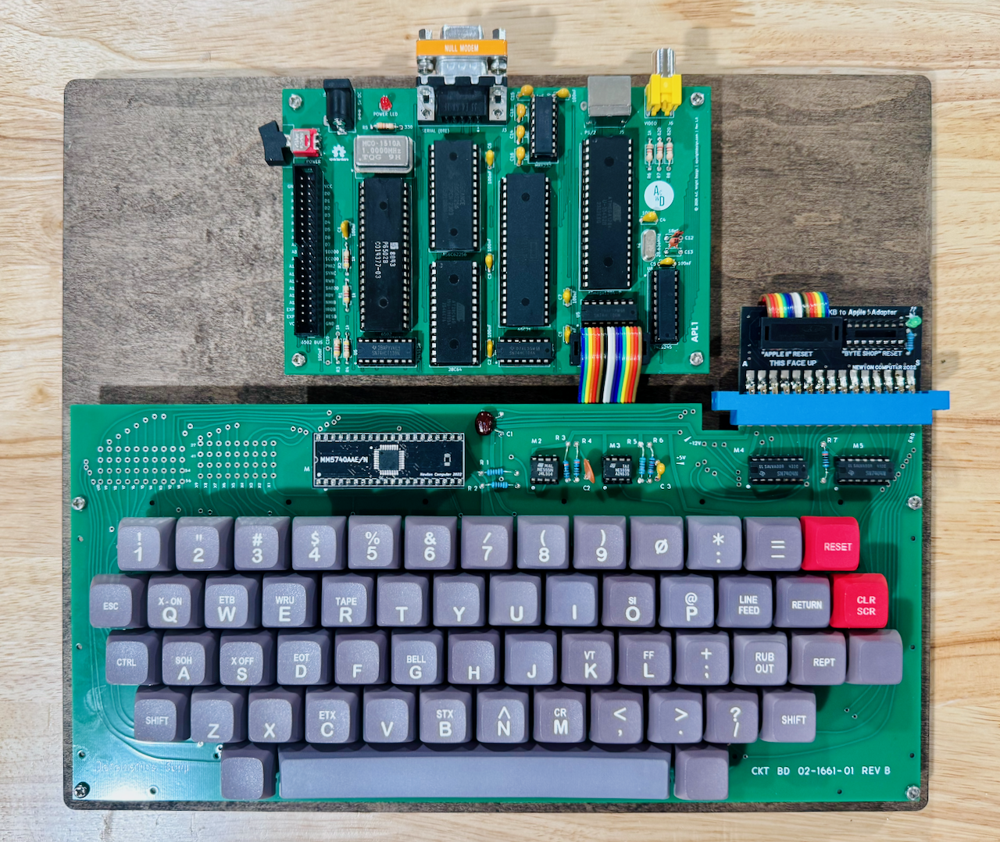

APL1
====

A homebrew **Apple 1** replica built around the **6502** microprocessor, with a modern microcontroller-based terminal that adds PS/2 keyboard and serial input alongside the original ASCII keyboard interface.

---

## Table of Contents

- [Overview](#overview)
- [Architecture](#architecture)
- [Hardware](#hardware)
  - [APL1 Board](#apl1-board)
    - [Revision History](#revision-history)
- [Firmware](#firmware)
  - [APL1 Controller](#apl1-controller)
  - [APL1 ROM](#apl1-rom)
- [CAD](#cad)
- [Production](#production)
- [Schematics](#schematics)
- [Libraries](#libraries)
- [Bill of Materials](#bill-of-materials)
- [License](#license)

---

## Overview

The **APL1** is a faithful recreation of the 1976 Apple 1 computer, rebuilt as an open-source KiCad project. It preserves the original 6502 + PIA architecture and the classic [WozMon](https://en.wikipedia.org/wiki/Woz_Monitor) firmware experience, while replacing the bulky discrete terminal section of the original with an ATmega1284 microcontroller. The MCU emulates the Apple 1 keyboard and display handshake exactly, but also exposes a PS/2 keyboard port and a serial terminal connection for modern convenience.

## Architecture

- **CPU**: MOS 6502 running at 1 MHz
- **RAM**: 32KB SRAM (AS6C62256)
- **ROM**: 8KB EEPROM (28C64) holding WozMon
- **PIA**: 65C21 — the Apple 1 keyboard/display interface
- **Terminal**: ATmega1284(P) controller emulating the original terminal handshake
- **Input**: Original ASCII keyboard header, PS/2 keyboard, and serial (RS-232) input
- **Output**: Serial terminal output, with composite video reserved for a future revision
- **Bus**: 16-bit address bus, 8-bit bidirectional data bus, standard 6502 control signals
- **Clock**: 1 MHz oscillator for the 6502; 28.63636 MHz crystal (8× NTSC colorburst) for the controller

## Hardware

This repository contains KiCad 7.0+ PCB designs for the APL1 board.

### APL1 Board
`Hardware/APL1/`

The single board hosting the 6502 CPU, memory, PIA, and the ATmega1284 terminal controller. Provides:

- **CPU**: 6502 running at 1 MHz
- **RAM**: 32KB SRAM (AS6C62256)
- **ROM**: 8KB EEPROM (28C64) preloaded with WozMon
- **PIA**: 65C21 keyboard/display interface (original Apple 1 footprint)
- **Terminal Controller**: ATmega1284(P) running APL1 Controller firmware
- **Keyboard buffer**: 74LS245 octal bus transceiver
- **Glue logic**: 74LS04, 74LS00, and 74LS138 address decoder
- **Serial**: MAX232 level shifter with DB-9 (DTE) connector
- **Input**: Original ASCII keyboard header and PS/2 keyboard connector
- **Video**: RCA composite video jack (reserved for a future firmware revision)
- **Reset**: Keyboard reset and clear controls handled by the controller
- **Power**: 5V DC via barrel jack, with power switch and indicator LED

#### Revision History

**Rev 1.0**

- Initial release.

## Firmware

This repository contains firmware for both the terminal controller and the system ROM.

### APL1 Controller
`Firmware/APL1 Controller/`

[PlatformIO](https://platformio.org/)-based firmware for the ATmega1284(P) terminal controller. Provides:

- Faithful emulation of the Apple 1 keyboard and display handshake (DA / RDAB)
- Original ASCII keyboard pass-through via the 74LS245 buffer
- PS/2 keyboard input with a custom Set-2 ISR decoder mapped to Apple 1 ASCII
- Serial (RS-232) terminal input and output at 115200 8N1
- Control shortcuts for clear screen, reset, and throttle ("slow") mode
- Keyboard reset and clear button handling
- Composite video output hooks reserved for a future revision

See [Firmware/APL1 Controller/README.md](./Firmware/APL1%20Controller/README.md) for build, flash, and pin-map details.

### APL1 ROM
`Firmware/APL1 ROM/`

The system ROM image built from **WozMon**, Steve Wozniak's original Apple 1 monitor, assembled with the [cc65](https://cc65.github.io/) toolchain and burned to a 28C64 EEPROM.

See [Firmware/APL1 ROM/README.md](./Firmware/APL1%20ROM/README.md) for build and programming instructions.

## CAD
`CAD/`

3D models and images for the APL1 board and its components.

## Production
`Production/`

JLCPCB-ready fabrication files, BOM, and component positions for PCB fabrication and assembly.

## Schematics
`Schematics/`

Schematics for the APL1 board.

## Libraries
`Libraries/`

Shared KiCad symbol and footprint libraries used across the APL1 hardware project.

## Bill of Materials

| Reference | Qty | Value | Description |
|-----------|-----|-------|-------------|
| C1–C10 | 10 | 100nF | Disc Capacitor |
| C11, C14, C15, C16 | 4 | 1µF | Disc Capacitor |
| C12, C13 | 2 | 18pF | Disc Capacitor |
| D1 | 1 | POWER LED | 3.0mm Power LED |
| J2 | 1 | KEYBOARD | ASCII Keyboard Header (DIP-16) |
| J3 | 1 | SERIAL (DTE) | DB-9 Male |
| J4 | 1 | 5V DC | DC Barrel Jack |
| J5 | 1 | PS/2 | 6-pin Mini-DIN (KMDGX-6S-BS) |
| J6 | 1 | VIDEO | RCA Jack (PJRAN1X1U0XX) |
| R1–R4, R6 | 5 | 1kΩ | 1/8W Resistor |
| R5 | 1 | 330Ω | 1/8W Resistor |
| R7, R8 | 2 | 820Ω | 1/8W Resistor |
| R9 | 2 | 10kΩ | 1/8W Resistor |
| SW1 | 1 | POWER | SPDT Switch (400MSP1R6BLKM6QE) |
| U1 | 1 | 74LS04 | Hex Inverter |
| U2 | 1 | 6502 | 6502 CPU |
| U3 | 1 | 65C21 | PIA |
| U4 | 1 | AS6C62256 | 32KB SRAM |
| U5 | 1 | 74LS00 | Quad NAND |
| U6 | 1 | 74LS138 | 3-to-8 Decoder |
| U7 | 1 | 28C64 | 8KB EEPROM |
| U8 | 1 | 74LS245 | Octal Bus Transceiver |
| U9 | 1 | MAX232 | RS-232 Transceiver |
| U10 | 1 | ATmega1284-P | Terminal Controller MCU |
| Y1 | 1 | 1MHz | DIP-14 Oscillator |
| Y2 | 1 | 28.636MHz | Crystal |

## License

Hardware designs are released under the [CERN Open Hardware Licence Version 2 – Permissive](https://ohwr.org/cern_ohl_p_v2.txt).